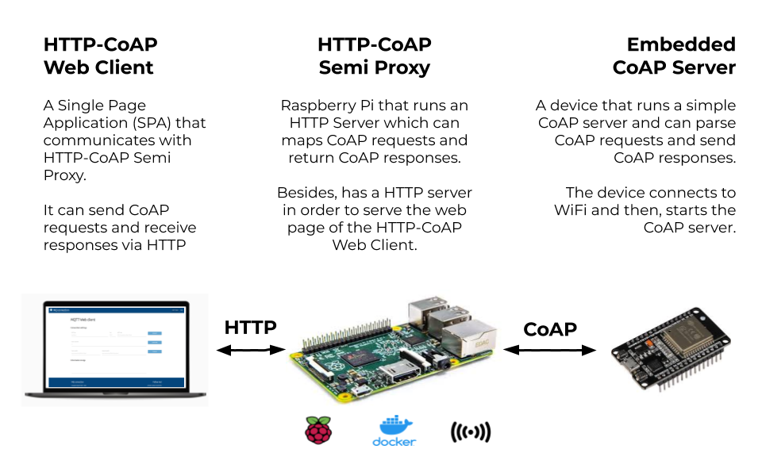
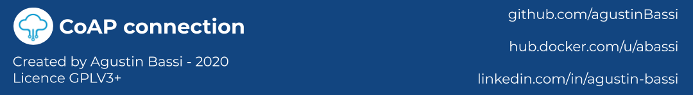

# Open source CoAP Platform

Author: Agustin Bassi - 2020

## 
## Table of Contents

* [Platform Introduction](#platform-introduction)
* [Install dependencies](#install-dependencies)
* [Run the application](#run-the-application)
* [Want to help?](#want-to-help-?)
* [License](#license)

## 
## Platform Description

The goal of this project is to create an open source CoAP Platform to be used as a part of an IoT system, based on CoAP technology.

The platform consists in several sub-application described below:

* **HTTP-CoAP Semi Proxy**: An HTTP REST API which maps an HTTP PUT requests (with JSON body with CoAP field) into desired CoAP request. It is a 'Semi Proxy' because it does not map a CoAP response into HTTP method. Instead, it sends the CoAP response into HTTP Response Body, but always returns an HTTP 200 status code.
* **HTTP-Coap Web Client**: An HTTP Client interface to interact with `HTTP-CoAP Semi Proxy`. There, the user can configure arguments for CoAP request like CoAp server, Port, Method, Payload, etc.
* **Embedded CoAP Server**: A git submodule of embedded CoAP server which can runs in different platforms like ESP32 or ESP8266 based in Arduino framework. More info in its [README file](embedded-coap-server/README.md).

All of this parts are well described in the [Project Wiki](https://github.com/agustinBassi/coap-connection/wiki). Please, refer to it in order to get all required information.

In the figure below there is a description of the platform modules and how they interact each others.



## 
## Install dependencies


The application runs over Raspberry Pi 3+ (or Linux system based in Debian). To install Raspberry Pi OS refer to [official documentation](https://www.raspberrypi.org/documentation/installation/installing-images/).

The platform needs the next dependencies.

* Python 3.x (installation steps in [official documentation](https://python.org)).
* Docker (installation steps in [official documentation](https://docs.docker.com/get-docker/)).
* Docker-Compose (installation steps in [official documentation](https://docs.docker.com/compose/install/)).

## 
## Run the application

Once dependencies are installed in the Raspberry Pi do the next steps.

1. Download the platform code (this repository) with the next command.

```
git clone https://github.com/agustinBassi/coap-connection.git
cd coap-connection/
```

2. Compile the `HTTP-CoAP Semi Proxy` docker image with the command below.

```
docker-compose build http-coap-semi-proxy
```

3. Start the `HTTP-CoAP Semi Proxy` and the `HTTP-Coap Web Client` with the next command.

```
docker-compose up
```

4. Run the `HTTP-Coap Web Client` opening [http://raspberri_pi_ip:5001/](http://raspberri_pi_ip:5001/) in the web browser.

## 
## Want to help?

Pull requests are welcome. For major changes, please open an issue first to discuss what you would like to change.

If someone want to helpme, every bit of effort will be appreciated. In [this link](https://github.com/agustinBassi/coap-connection/projects/1) there is the project status board. You can take any card you want (or propose one) from the ToDo list and start to work.

If you find it useful please helpme following my Github user and give to this project a Star. This will animate me to continue contribuiting with the great open source community.

## 
## License

This project is licensed under the GPLV3 License.

