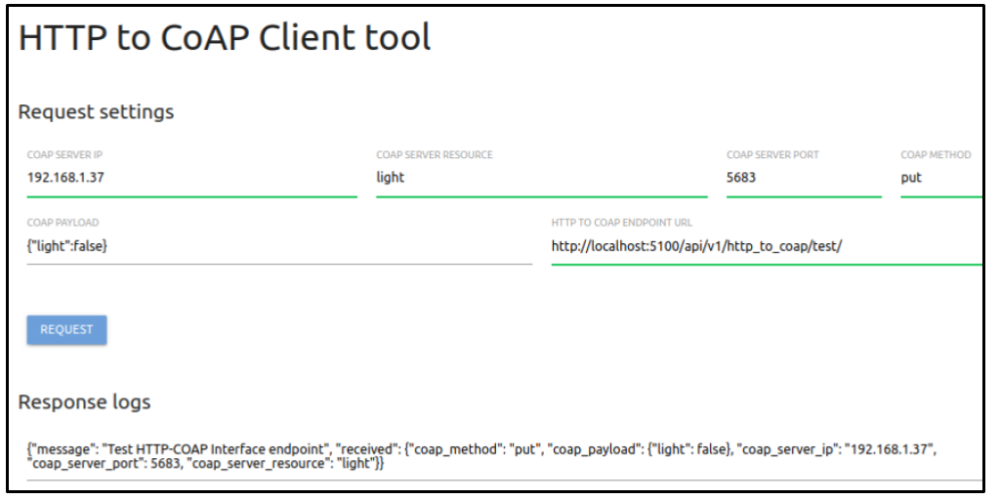

# Open source CoAP Platform

Author: Agustin Bassi - 2020

## 
## Table of Contents

* [Platform Introduction](#platform-introduction)
* [Install dependencies](#install-dependencies)
* [Run the application](#run-the-application)
* [Test the application](#test-the-application)
* [Want to help?](#want-to-help-?)
* [License](#license)

## 
## Platform Description

The goal of this project is to create an open source CoAP Platform to be used as a part of an IoT system, based on CoAP technology.

The platform consists in several sub-application described below:

* **HTTP-CoAP Interface**: An HTTP REST API which maps an HTTP PUT requests (with JSON body containing CoAP fields request) into desired CoAP request. It is an 'Interface' because it does not map a HTTP request method into CoAP request method, nor does not map CoAP status code into HTTP status code. Instead, it acts as an interface where a user can execute CoAP requests from web a client and can see the CoAP response as well.
* **HTTP-CoAP Web Client**: A Single Page Application (SPA) HTTP Client interface to interact with `HTTP-CoAP Interface` API. There, the user can configure arguments for CoAP request like CoAp server, Port, Method, Payload, etc.
* **Embedded CoAP Server**: A git submodule of embedded CoAP server which can runs in different platforms like ESP32 or ESP8266 based in Arduino framework. More info in its [README file](https://github.com/agustinBassi/embedded-coap-server).

All of this parts are well described in the [Project Wiki](https://github.com/agustinBassi/coap-connection/wiki). Please, refer to it in order to get all required information.

In the figure below there is a description of the platform modules and how they interact each others.


## 
## Install dependencies


The application runs over Raspberry Pi 3+ (or any system with Python & Docker Compose). To install Raspberry Pi OS refer to [official documentation](https://www.raspberrypi.org/documentation/installation/installing-images/).

The platform needs the next dependencies.

* Python 3.x (installation steps in [official documentation](https://python.org)).
* Docker (installation steps in [official documentation](https://docs.docker.com/get-docker/)).
* Docker-Compose (installation steps in [official documentation](https://docs.docker.com/compose/install/)).

## 
## Run the application

Once dependencies are installed in the system, do the next steps.

1. Download the platform code (this repository) with the next command.

```
git clone https://github.com/agustinBassi/coap-connection.git
cd coap-connection/
```

2. Compile the `HTTP-CoAP Interface` docker image with the command below.

```
docker-compose build http-coap-interface
```

3. Start the `HTTP-CoAP Interface` and the `HTTP-CoAP Web Client` with the next command.

```
docker-compose up
```

4. Run the `HTTP-CoAP Web Client` opening [http://raspberri_pi_ip:5001/](http://raspberri_pi_ip:5001/) in the web browser.


## 
## Test the application

Once the containers are running and the `HTTP-CoAP Web Client` opened in the browser, its time to test if communication between web client and `HTTP-CoAP Interface` works ok. To avoid to get a CoAP server running in this step, the best way to test is calling and endpoint that will echo the CoAP request settings into the `Response Logs` section. The default fields values will call to the test endpoint without fill any field in the web client interface. So, just press `Request` button in the interface, and the echo with default values will be shown in the `Response Logs` section. 

In the screenshot below there is an example with all possible CoAP fields set, in order to show them in the logs.



If a real CoAP request to a real CoAP server is needed, just put in the `HTTP TO COAP ENDPOINT URL` the value [http://localhost:5100/api/v1/http_to_coap/](http://localhost:5100/api/v1/http_to_coap/). If the application is running in a remote host, like a Raspberry Pi, change `localhost` to the remote host IP address in the URL field.


## 
## Want to help?

Pull requests are welcome. For major changes, please open an issue first to discuss what you would like to change.

If someone want to helpme, every bit of effort will be appreciated. In [this link](https://github.com/agustinBassi/coap-connection/projects/1) there is the project status board. You can take any card you want (or propose one) from the ToDo list and start to work.

If you find it useful please helpme following my Github user and give to this project a Star. This will animate me to continue contribuiting with the great open source community.

## 
## License

This project is licensed under the GPLV3 License.

